# 

---

## 💻 **Tech Arsenal**

<table>
<tr>
<td align="center" width="16%">

 <b>JavaScript</b>
</td>
<td align="center" width="16%">

 <b>Python</b>
</td>
<td align="center" width="16%">

 <b>PHP</b>
</td>
<td align="center" width="16%">

 <b>HTML5</b>
</td>
<td align="center" width="16%">

 <b>CSS3</b>
</td>
<td align="center" width="16%">

 <b>C++</b>
</td>
</tr>
</table>

 

<table>
<tr>
<td align="center" width="12.5%">

 <b>React</b>
</td>
<td align="center" width="12.5%">

 <b>Laravel</b>
</td>
<td align="center" width="12.5%">

 <b>Flask</b>
</td>
<td align="center" width="12.5%">

 <b>Bootstrap</b>
</td>
<td align="center" width="12.5%">

 <b>MySQL</b>
</td>
<td align="center" width="12.5%">

 <b>SQLite</b>
</td>
<td align="center" width="12.5%">

 <b>Git</b>
</td>
<td align="center" width="12.5%">

 <b>VS Code</b>
</td>
</tr>
</table>

---

## 🎯 **Featured Projects**

<table>
<tr>
<td width="50%" valign="top">

### 🏢 **ReserverHub.com**

**🎯 Live Production Platform**

```mermaid
flowchart LR
    A[👤 Users] --> B[🔐 RBAC]
    B --> C[📋 Booking]
    C --> D[💾 MySQL]
    style A fill:#ff6b6b
    style B fill:#4ecdc4
    style C fill:#45b7d1
    style D fill:#96ceb4
```

✨ **Laravel + Blade Framework**  
🛡️ **Advanced RBAC System**  
📱 **Custom Responsive UI**  
🗄️ **Optimized MySQL Schema**

</td>
<td width="50%" valign="top">

### 🤖 **Logix Language**

**🧬 AI-Powered DSL**

```mermaid
flowchart LR
    A[📝 DSL] --> B[🤖 LLM]
    B --> C[⚡ C++]
    C --> D[🎯 Binary]
    style A fill:#ff9ff3
    style B fill:#54a0ff
    style C fill:#5f27cd
    style D fill:#00d2d3
```

🤖 **LLM-Powered Translation**  
⚡ **Native C++ Compilation**  
🚀 **Task Automation Engine**  
🔨 **Custom Compiler Pipeline**

</td>
</tr>
</table>

---

## 🌈 **Code Distribution**

<table>
<tr>
<td align="center" width="16.66%">

 **JavaScript**
 🔥 **34%**
</td>
<td align="center" width="16.66%">

 **Python**
 🐍 **24%**
</td>
<td align="center" width="16.66%">

 **PHP**
 ⚡ **16%**
</td>
<td align="center" width="16.66%">

 **HTML/CSS**
 🨠**12%**
</td>
<td align="center" width="16.66%">

 **C++**
 ⚙️ **8%**
</td>
<td align="center" width="16.66%">

 **SQL**
 💾 **6%**
</td>
</tr>
</table>

---

## 🚀 **What I Build**

<table>
<tr>
<td align="center" width="33%">

 **🨠Frontend Magic**
 Crafting smooth, responsive interfaces
</td>
<td align="center" width="33%">

 **⚙️ Backend Power**
 Building rock-solid server systems
</td>
<td align="center" width="33%">

 **🤖 AI Innovation**
 Creating intelligent solutions
</td>
</tr>
</table>

---

## 📫 **Let's Connect & Build Something Amazing**

 

### 🔥 **Always coding something cool!**

---

**⭐ Thanks for visiting my digital space! ⭐**

